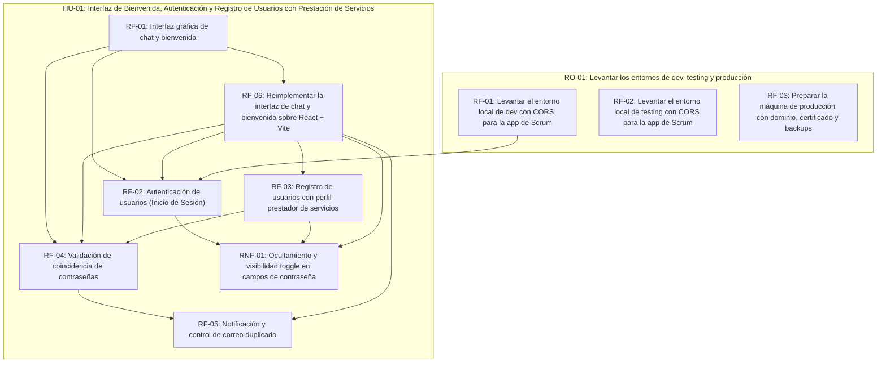

# Grafo de Dependencias -- Profesionales

_Generado automaticamente el 2026-09-30T13:58:55.638Z -- no editar a mano, se sobreescribe en cada publicacion._

```mermaid
graph TD
  subgraph US_1785510643692["HU-01: Interfaz de Bienvenida, Autenticación y Registro de Usuarios con Prestación de Servicios"]
    REQ_1785771199977["RF-01: Interfaz gráfica de chat y bienvenida"]
    REQ_1785771214294["RF-02: Autenticación de usuarios (Inicio de Sesión)"]
    REQ_1785771214393["RF-03: Registro de usuarios con perfil prestador de servicios"]
    REQ_1785771214462["RF-04: Validación de coincidencia de contraseñas"]
    REQ_1785771214528["RF-05: Notificación y control de correo duplicado"]
    REQ_1785771214595["RNF-01: Ocultamiento y visibilidad toggle en campos de contraseña"]
    REQ_1790685849827["RF-06: Reimplementar la interfaz de chat y bienvenida sobre React + Vite"]
  end
  subgraph US_1790688869961["RO-01: Levantar los entornos de dev, testing y producción"]
    REQ_1790688869968["RF-01: Levantar el entorno local de dev con CORS para la app de Scrum"]
    REQ_1790688952068["RF-02: Levantar el entorno local de testing con CORS para la app de Scrum"]
    REQ_1790688965165["RF-03: Preparar la máquina de producción con dominio, certificado y backups"]
  end
  REQ_1785771199977 --> REQ_1785771214294
  REQ_1790685849827 --> REQ_1785771214294
  REQ_1790688869968 --> REQ_1785771214294
  REQ_1790685849827 --> REQ_1785771214393
  REQ_1785771199977 --> REQ_1785771214462
  REQ_1790685849827 --> REQ_1785771214462
  REQ_1785771214393 --> REQ_1785771214462
  REQ_1785771214462 --> REQ_1785771214528
  REQ_1790685849827 --> REQ_1785771214528
  REQ_1785771214294 --> REQ_1785771214595
  REQ_1785771214393 --> REQ_1785771214595
  REQ_1790685849827 --> REQ_1785771214595
  REQ_1785771199977 --> REQ_1790685849827
```